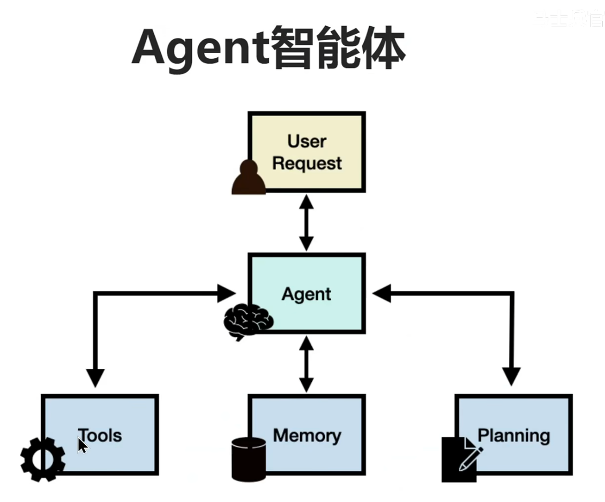

# day05

# day05-MCP Server开发

## 一.什么是Agent智能体

1. 当用户的请求来到智能体里面时，由大模型开始做对应的决策，然后生成一份计划，一边生成一边读取上下文，然后根据计划调用对应的工具；
2. 智能体相当于给一个人加上了手和脚，原本只能说话，现在可以使用工具，拥有了额外的能力；
3. 例如我们在当跟deepseek大模型对话时，输入帮我预定一张车票，它只会响应你一份md文档，并不会在对应的App购买车票，这种时候怎么办呢，这时候就需要我们在大模型的基础上做智能体开发，让大模型不局限于文本生成，而是真实的帮我们去购买车票；
4. 智能体就是从大模型的外部去扩展能力，像我们使用的字节的Trae编辑器就内置了智能体，当我们对话时，它不止可以对话，还可以使用我们的文件系统来做代码编辑，终端执行命令，联网搜索相关资料，在线预览页面等等...
5. 为什么要提到智能体呢，因为MCP要在智能体里面调用工具要用到，MCP没有出来之前，大模型也能调用工具通过：Function Calling，现在有MCP之后通过MCP去调用工具，调用大模型外部工具的通信协议（MCP）。
6. 使用MCP调用外部工具很方便，因为国内外大模型都支持MCP了，之前每个大模型调用工具的Function Calling都不一样，当切换模型非常麻烦，所有推荐使用统一调外部工具的通信协议MCP。
7. 例如图：

## 二.MCP 与 Function Calling的区别

|类别|MCP（Model Context Protocol）|Function Calling|
| ----------| -----------------------------| ------------------------------|
|性质|协议|功能|
|范围|通用（多数据源、多功能）|特定场景（单一数据源或功能）|
|目标|统一接口、实现互操作|扩展模型能力|
|实现|基于标准协议|依赖于特定模型实现|
|开发复杂度|低：通过统一协议实现多源兼容|高：需要为每个任务单独开发函数|
|复用性|高：一次开发，可多场景使用|低：函数通常为特定任务设计|
|灵活性|高：支持动态适配和扩展|低：功能扩展需要额外开发|

## 三.MCP协议支持的两种主要的通信机制

1. 本地通信（了解）：通过stdio传输数据，使用于在同一台机器上运行的客户端和服务区之间的通信；
2. 远程通信（主流）：利用SSE于HTTP结合，实现跨网络的实时数据通信。使用于需要访问远程资源或分布式部署的场景。

## 三.MCP的架构组成

1. MCP服务器(server)：负责与特定数据源(如文件、数据库、API等)交互，提供标准化的功能接口。每个MCP Server可以被视作封装良好的“小型工具服务”，对应某一类功能或数据。
2. MCP客户端(Client)：充当AI模型与MCP服务器之间的通信桥梁，将用户或模型的请求转换为标准化的协议调用，并将服务器返回的数据反馈给AI模型。
3. 前端 > 后端（java） >  AI模型 > MCP客户端（调用工具） > MCP服务器（工具）
