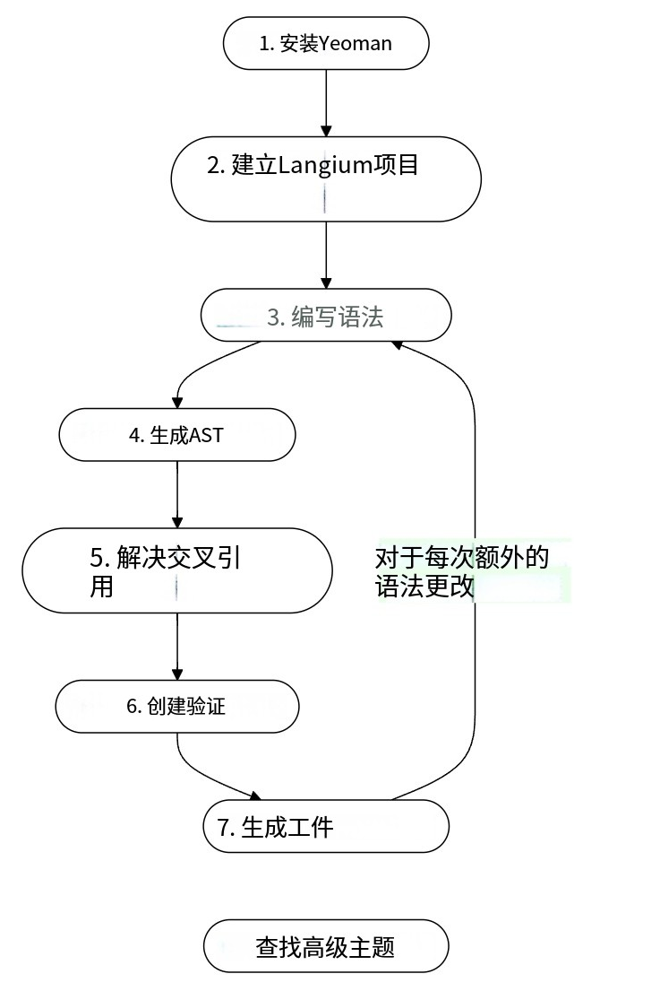

# day01

# day01-学习langium官方文档的Minilogo



## 一.Minilogo

它是 Logo 编程语言的一个小型实现。Logo 本身很像 Python 中的 Turtle。最终，我们将使用 MiniLogo 来表达可用于在画布上绘图的绘图指令。

## 二.langium执行流程

1. 编写语法（定制你的语言组合方式和特性）
2. 生成AST（执行脚本：npm run langium:generate）
3. 解决交叉引用（您可以引用语言中的其他元素。例如，您可以在函数调用中引用变量。Langium 会自动处理你在语法中定义的交叉引用：）
4. 创建验证器（让开发者能够在编写代码时立即发现问题，而不需要等到运行时才发现错误）
5. 生成对应平台代码（js、java、c、python...等通用编程语言）

## 三.扩展

使用项目自带的vscode扩展项目构建插件，并安装提供ISP服务（语言服务器协议），作用：代码高亮，关键词补全

## 四.示例

### 一.编写语法（定制你的语言组合方式和特性）

```
/**
 * MiniLogo 语言语法定义
 * 
 * MiniLogo 是一个简单的绘图语言，支持基本的绘图命令、函数定义、
 * 循环控制和表达式计算。该语法文件定义了语言的完整结构。
 */
grammar MinLogo

/**
 * 模型 - 语言的入口点
 * 
 * 一个 MiniLogo 程序由任意数量的语句(Stmt)和函数定义(Def)组成，
 * 它们可以以任意顺序出现。使用 += 操作符表示可以有多个元素。
 * 
 * 示例:
 *   def square(size) { ... }  // 函数定义
 *   pen(down)                 // 语句
 *   move(10, 20)             // 语句
 */
entry Model:(stmts+=Stmt | defs+=Def)*;

/**
 * 语句 - 可执行的指令
 * 
 * 语句包括基本命令(Cmd)和宏调用(Macro)两种类型
 */
Stmt: Cmd | Macro;

/**
 * 基本命令 - 绘图的基础操作
 * 
 * 包括笔的控制、移动、颜色设置和循环控制
 */
Cmd: Pen | Move | Color | For;

/**
 * 宏调用 - 调用用户定义的函数
 * 
 * 通过函数名和参数列表来调用之前定义的函数
 * def=[Def:ID] 表示引用一个已定义的函数
 * 
 * 示例: square(50), triangle(30, 40)
 */
Macro: def=[Def:ID] '(' (args+=Expr (',' args+=Expr)*)? ')';

/**
 * 函数定义 - 用户自定义的可重用代码块
 * 
 * 定义一个函数，包含函数名、参数列表和函数体
 * 
 * 语法: def 函数名(参数1, 参数2, ...) { 语句列表 }
 * 示例: def square(size) { for i=1 to 4 { move(size, 0) } }
 */
Def: 'def' name=ID '(' (params+=Param (','  params+=Param)*)? ')' Block;

/**
 * 代码块片段 - 用花括号包围的语句集合
 * 
 * fragment 关键字表示这是一个可重用的语法片段
 * 用于函数体和循环体的定义
 */
fragment Block: '{' body+=Stmt* '}';

/**
 * 参数 - 函数参数或循环变量的定义
 * 
 * 简单的标识符，用于函数参数和循环变量
 */
Param: name=ID;


// ==================== 基本绘图命令 ====================

/**
 * 笔控制命令 - 控制绘图笔的状态
 * 
 * pen(up)   - 抬起笔，移动时不绘制线条
 * pen(down) - 放下笔，移动时绘制线条
 */
Pen:    'pen' '(' mode=('up' | 'down') ')';

/**
 * 移动命令 - 移动绘图位置
 * 
 * move(x, y) - 将绘图位置移动到相对坐标(x, y)
 * x 和 y 可以是任意表达式
 */
Move:   'move' '(' ex=Expr ',' ey=Expr ')';

/**
 * 循环命令 - for 循环控制结构
 * 
 * for 变量名 = 起始值 to 结束值 { 循环体 }
 * 示例: for i=1 to 4 { move(10, 0) }
 */
For:    'for' var=Param '=' e1=Expr 'to' e2=Expr Block;

/**
 * 颜色设置命令 - 设置绘图颜色
 * 
 * 支持三种颜色格式:
 * 1. RGB 值: color(255, 0, 0)     // 红色
 * 2. 颜色名: color(red)           // 预定义颜色名
 * 3. 十六进制: color(#FF0000)     // 十六进制颜色值
 */
Color:  'color' '(' ((r=Expr ',' g=Expr ',' b=Expr) | color=ID | color=HEX) ')';

// ==================== 表达式系统 ====================

/**
 * 表达式 - 可计算的数值表达式
 * 
 * 表达式系统支持算术运算，具有正确的运算符优先级
 * 从 Add 开始，确保加减法的优先级低于乘除法
 */
Expr: Add;

/**
 * 加法和减法表达式 - 最低优先级的运算
 * 
 * 使用左结合的方式处理连续的加减运算
 * infers Expr 表示推断出的类型仍然是 Expr
 * {infer BinExpr.el=current} 创建二元表达式节点
 */
Add infers Expr:
    Mult ({infer BinExpr.el=current} op=('+'|'-') e2=Mult)*;

/**
 * 乘法和除法表达式 - 较高优先级的运算
 * 
 * 乘除法的优先级高于加减法
 */
Mult infers Expr:
    PrimExpr ({infer BinExpr.el=current} op=('*' | '/') e2=PrimExpr)*;

/**
 * 基础表达式 - 最高优先级的表达式元素
 * 
 * 包括字面量、变量引用、分组表达式和负数表达式
 */
PrimExpr: Lit | Ref | Group | NegExpr;

/**
 * 字面量 - 整数常量
 * 
 * 直接的数值，如: 42, -10, 0
 */
Lit:        val=INT;

/**
 * 变量引用 - 引用函数参数或循环变量
 * 
 * 通过标识符引用之前定义的参数
 * val=[Param:ID] 表示引用一个参数
 */
Ref:         val=[Param:ID];

/**
 * 分组表达式 - 用括号改变运算优先级
 * 
 * 用括号包围的表达式，如: (a + b) * c
 */
Group:      '(' ge=Expr ')';

/**
 * 负数表达式 - 一元负号运算
 * 
 * 对表达式取负值，如: -x, -(a + b)
 */
NegExpr:    '-' ne=Expr;

// ==================== 词法规则 (Terminal Rules) ====================

/**
 * 十六进制颜色值 - 匹配 #RRGGBB 格式的颜色
 * 
 * 格式: #后跟1个或多个十六进制字符(0-9, a-f, A-F)
 * 示例: #FF0000, #00ff00, #0000FF
 */
terminal HEX returns string:    /#(\d|[a-fA-F])+/;

/**
 * 标识符 - 变量名、函数名等的命名规则
 * 
 * 以字母或下划线开头，后跟任意数量的字母、数字或下划线
 * 示例: myFunction, _variable, test123
 */
terminal ID returns string:     /[_a-zA-Z][\w_]*/;

/**
 * 整数 - 数值字面量
 * 
 * 可选的负号后跟一个或多个数字
 * 示例: 42, -10, 0, 999
 */
terminal INT returns number:    /-?[0-9]+/;

hidden terminal WS:             /\s+/;

hidden terminal ML_COMMENT:     /\/\*[\s\S]*?\*\//;

hidden terminal SL_COMMENT:     /\/\/[^\n\r]*/;
```

### 二.生成 AST（执行脚本：npm run langium:generate）

抽象语法树，AST 是源代码的树形表示，可用于分析和转换代码。

```
# 在 language 包目录下运行
npm run langium:generate

# 或在根目录运行
npm run langium:generate

# 生成成功后，packages\language\src\generated 目录下面会有三个文件：1.ast.ts；2.grammar.ts；3.module.ts
```

### 三.解决交叉引用（引用语言中的其他元素但是引用找不到目标，Langium 会自动处理你在语法中定义的交叉引用：）

```
### 引用语法

在语法中使用 `[Type:Terminal]` 语法定义引用：

```langium
// 宏调用引用函数定义
Macro: def=[Def:ID] '(' (args+=Expr (',' args+=Expr)*)? ')';

// 变量引用参数
Ref: val=[Param:ID];
```

### 作用域解析

Langium 自动处理作用域解析，但可以自定义：

```typescript
// 自定义作用域提供者
export class MiniLogoScopeProvider extends DefaultScopeProvider {
    override getScope(context: ReferenceInfo): Scope {
        // 自定义作用域逻辑
        return super.getScope(context);
    }
}
```

```

### 四.创建验证器（让开发者能够在编写代码时立即发现问题，而不需要等到运行时才发现错误）

#### **验证器结构**

```typescript
export class MiniLogoValidator {
    /**
     * 检查模型级别的验证
     */
    checkModel(model: Model, accept: ValidationAcceptor): void {
        // 检查重复定义
        const defs = model.defs;
        const previousNames = new Set<string>();
        for (const def of defs) {
            if (previousNames.has(def.name.toLowerCase())) {
                accept('error', 
                    'Definition cannot re-define an existing definition name.', 
                    { node: def, property: 'name' }
                );
            } else {
                previousNames.add(def.name.toLowerCase());
            }
        }
    }

    /**
     * 检查函数定义
     */
    checkDef(def: Def, accept: ValidationAcceptor): void {
        // 检查重复参数
        const params = def.params;
        const previousNames = new Set<string>();
        for (const param of params) {
            if (previousNames.has(param.name.toLowerCase())) {
                accept('error', 
                    `Duplicate parameter name '${param.name}'`, 
                    { node: param, property: 'name' }
                );
            } else {
                previousNames.add(param.name.toLowerCase());
            }
        }
    }
}

```

#### **注册验证检查**

```typescript
export function registerValidationChecks(services: MiniLogoServices) {
    const registry = services.validation.ValidationRegistry;
    const validator = services.validation.MiniLogoValidator;
    const checks: ValidationChecks<MiniLogoAstType> = {
        Model: validator.checkModel,
        Def: validator.checkDef,
        // 可以添加更多验证
    };
    registry.register(checks, validator);
}

```

#### **验证类型**

- error：错误，阻止编译
- warning：警告，不阻止编译
- info：信息提示
- hint：提示

### 五.生成对应平台代码（js、java、c、python...等通用编程语言）

#### 生成器基础

```typescript
import { CompositeGeneratorNode, NL, toString } from 'langium';
import { Model } from '../generated/ast.js';

export function generateJavaScript(model: Model, filePath: string, destination: string | undefined): string {
    const data = extractDestinationAndName(filePath, destination);
    const generatedFilePath = `${path.join(data.destination, data.name)}.js`;

    // Generate function definitions
    const functionDefs = model.defs.map(def => {
        const params = def.params?.map(p => p.name).join(', ') || '';
        const bodyCode = generateStatements(def.body);
        return `function ${def.name}(${params}) {\n${bodyCode}\n}`;
    }).join('\n\n');

    // Generate main program statements
    const mainCode = generateStatements(model.stmts);

    const fileNode = expandToNode`
        "use strict";

        // MiniLogo Drawing Engine
        class MiniLogoCanvas {
            constructor(canvasId = 'minilogo-canvas') {
                this.canvas = document.getElementById(canvasId) || this.createCanvas();
                this.ctx = this.canvas.getContext('2d');
                this.x = 100;
                this.y = 100;
                this.penDown = false;
                this.color = '#000000';
                this.ctx.lineWidth = 2;
                this.ctx.lineCap = 'round';
            }

            createCanvas() {
                const canvas = document.createElement('canvas');
                canvas.id = 'minilogo-canvas';
                canvas.width = 800;
                canvas.height = 600;
                canvas.style.border = '1px solid #ccc';
                document.body.appendChild(canvas);
                return canvas;
            }

            pen(mode) {
                this.penDown = (mode === 'down');
            }

            move(dx, dy) {
                const newX = this.x + dx;
                const newY = this.y - dy; // Canvas Y轴向下，MiniLogo Y轴向上
                
                if (this.penDown) {
                    this.ctx.beginPath();
                    this.ctx.moveTo(this.x, this.y);
                    this.ctx.lineTo(newX, newY);
                    this.ctx.strokeStyle = this.color;
                    this.ctx.stroke();
                }
                
                this.x = newX;
                this.y = newY;
            }

            setColor(c) {
                const colors = {
                    'red': '#FF0000',
                    'blue': '#0000FF', 
                    'green': '#00FF00',
                    'black': '#000000',
                    'yellow': '#FFFF00',
                    'purple': '#800080',
                    'orange': '#FFA500',
                    'white': '#FFFFFF'
                };
                this.color = colors[c] || c;
            }
        }

        // Create drawing instance
        const minilogo = new MiniLogoCanvas();
        
        // Helper functions for drawing commands
        function pen(mode) { minilogo.pen(mode); }
        function move(dx, dy) { minilogo.move(dx, dy); }
        function color(c) { minilogo.setColor(c); }

        ${functionDefs}

        // Main program
        ${mainCode}
        
        console.log('MiniLogo drawing completed!');
    `.appendNewLineIfNotEmpty();

    if (!fs.existsSync(data.destination)) {
        fs.mkdirSync(data.destination, { recursive: true });
    }
    fs.writeFileSync(generatedFilePath, toString(fileNode));
    return generatedFilePath;
}
```

## 五.总结

1. 关键是要理解 Langium 的核心概念：语法定义、AST 生成、交叉引用、验证和代码生成。通过实践和迭代，你将能够创建出功能强大的自定义语言。
2. 需要自己完成的步骤：语法定义，交叉引用，验证和代码生成。
3. 抽象语法树(AST)是源代码的一种抽象表示，帮助编译器、解释器、静态分析工具和优化器更高效地处理和理解程序代码。它简化了源代码的结构，便于进行各种分析、优化和转换，广泛应用于编译器设计、代码分析、程序优化、代码生成等领域，树中的每个节点都代表一个语法元素，如：表达式、语句。
